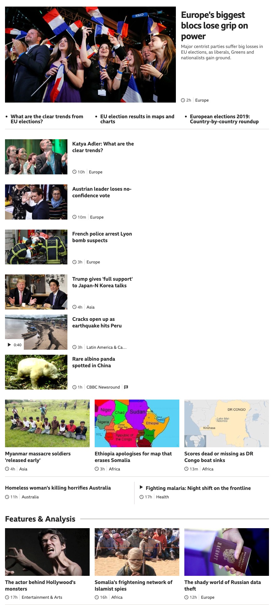
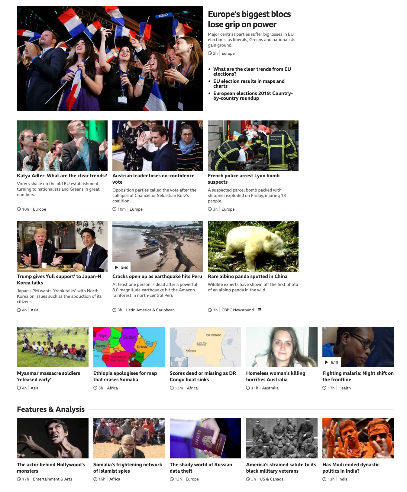

# HTML/CSS S6: Ejercicios

### Ejercicio 1: Responsive con Flexbox: Noticias

Haciendo uso de Flexbox y Media Queries realiza un HTML y CSS que luzca lo más parecido posible a los diseños de la página siguiente. Aplica también lo aprendido con BEM (es opcional trabajar con Bootstrap).

Es importante que se comporte bien en todas las resoluciones. Fíjate en cómo están colocados los elementos en cada tamaño.

Diseño mobile:

Diseño desktop:

